# HWM095 Manual

 B&R PLC li 4 Köşe Kaynak Makinesi
 Tabla hareketleri silindir yerine servo motor ile yapılır.  
 Alt ve üstte çapak yönlendirme silindirleri vardır.

## Manual Mode Page
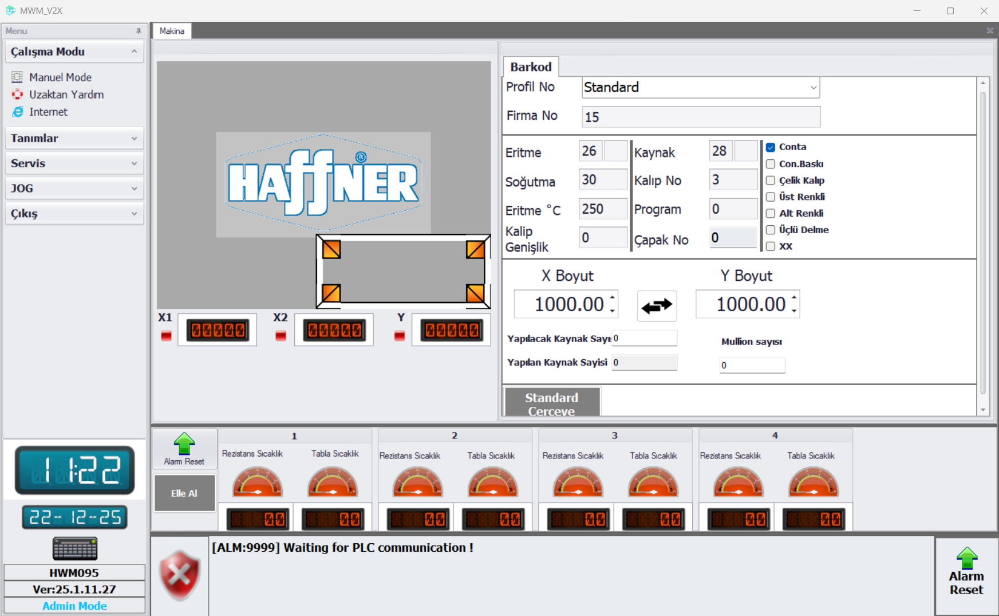

**Manual Mode Page :** Profillerde tanımlı olan profil seçildikten sonra profile ait X ve Y ölçüsü girilir, herhangi bir hata yok ise ve alarm-reset yapıldıysa start butonuna basarak kaynak başlatılır. 

## Barcode Page
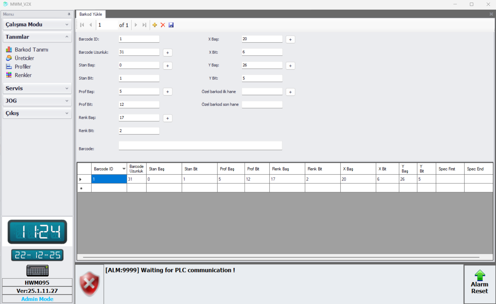

**Barcode Description :** Barkod dizaynı için gerekli parametreler değiştirilip istenilen çıktı oluşturulur.

## Manufactures Page
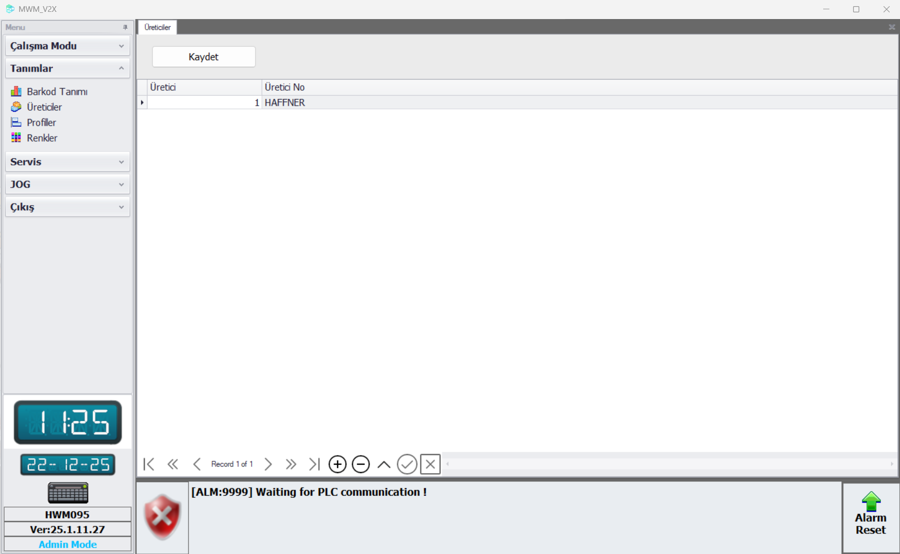

**Manufacturers :** Profil üreticileri bu sayfada tanımlanır. 

## Profiles Page
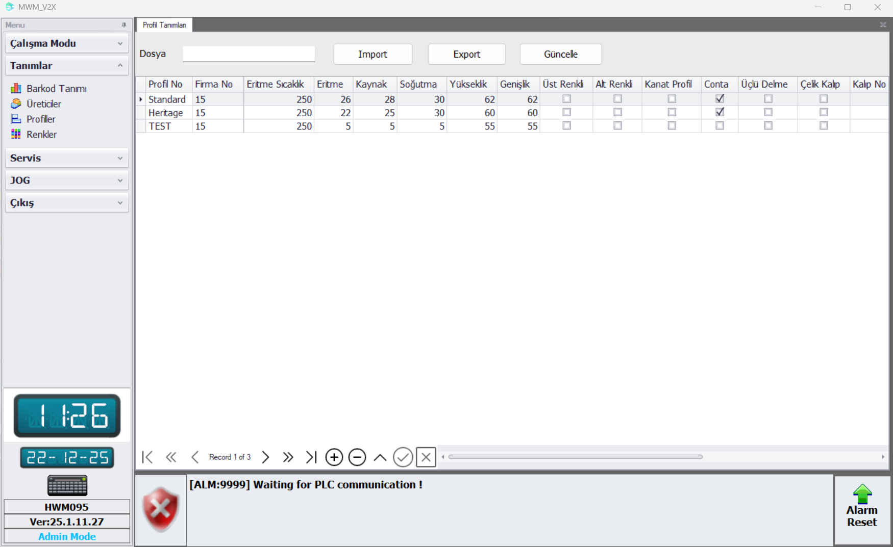

**Profiles :** Profillere ait detaylar, işlemler veya genel işlemlere ait zamanlar bu sayfada tanımlanır, profil dataları 'Import' veya 'Export' butonları ile içe veya dışa aktarılabilir.

## Colours Page
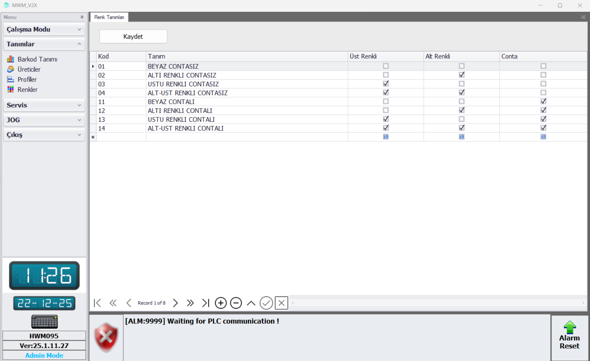

**Colours :** Bu sayfada genel renk ve conta bilgisi oluşturulur ve değiştirilebilir.

## Machine Settings Page
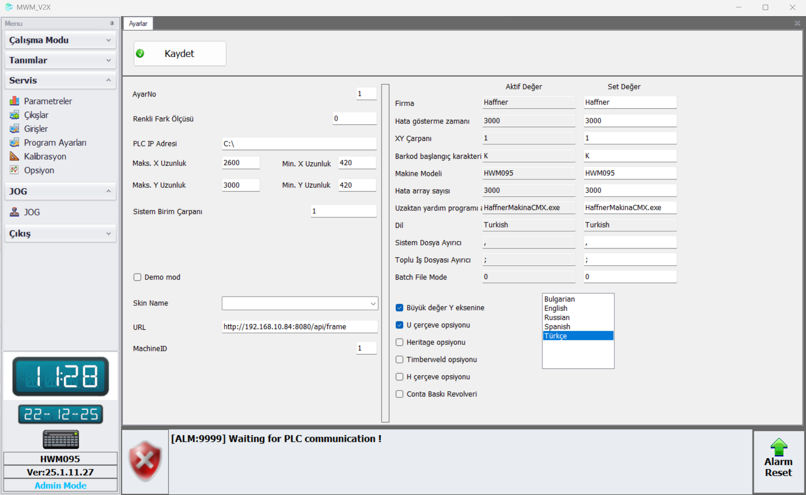

**Program Settings :** Farklı kaynak opsiyonları, dil ayarları ,firma, makine modeli, dosya ayırıcı ve barkod XY çarpanı gibi bilgiler bu sayfada bulunmaktadır.   

## Options Page
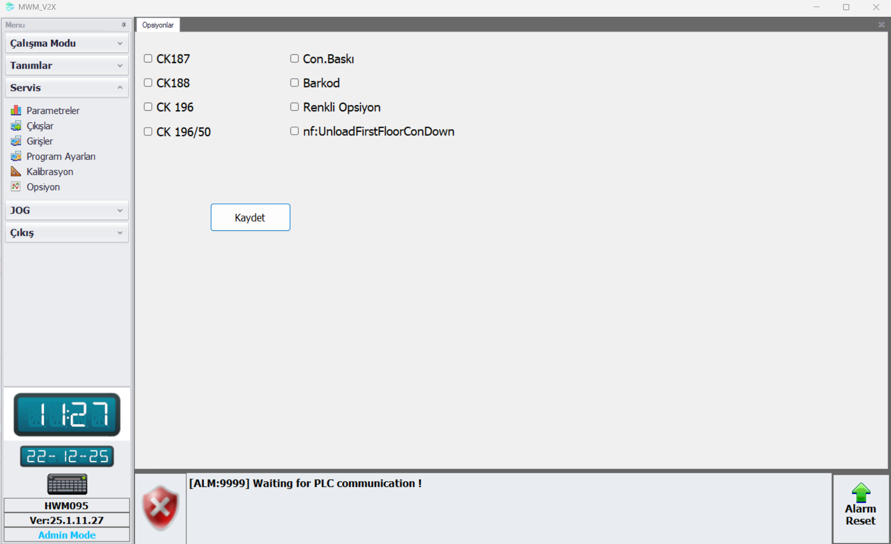

**Options :** Soğutmada kullanılacak CK ve konveyör opsiyonları, conta baskı, barkod, renkli opsiyonu bu sayfada seçilmektedir. 

## Measurement Control Page
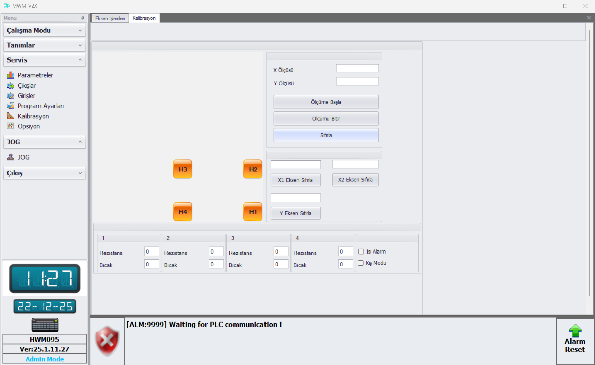

**Measurement Control Page :** X ve Y ölçüsü girilerek 'Ölçüme Başla' butonuna basılır eksen hareketleri sonlandıktan sonra 'Ölçümü Bitir' butonuna basıldıktan sonra eksenlerin son hareketleri yaptırılır ve ölçü kontrol edilir. 'Axis Eksen Sıfırla' butonuna basılarak ilgili eksen pozisyonu kalibre edilir. Rezistans ve bıçak offset değerleri bu sayfadan ayarlanabilir. 

## Jog Page
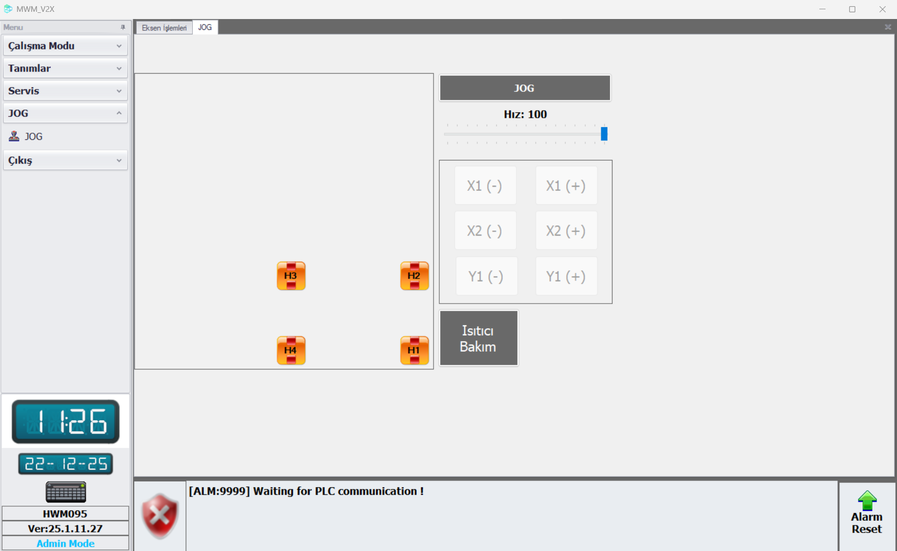

**Jog Page :** Jog sayfasında bulunan 'Jog' butonuna basıldıktan sonra ilgili eksen butonuna basılarak, istenilen pozisyon gitmesi için 'Axis-' ve 'Axis+' butonları kullanılır.

## Axis Operations Page
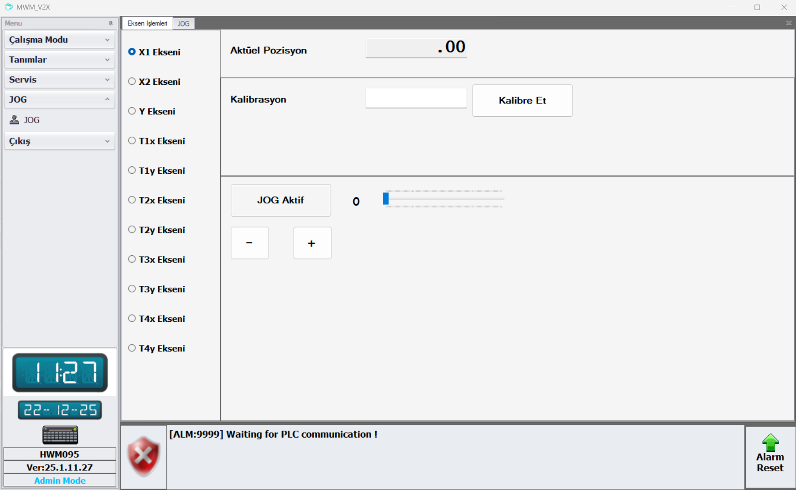

**Axis Operations Page :** Eksen işlemleri sayfasında ilgili eksenin poziyonunu sıfırlamak için değer yazılıp 'Kalibre Et' butonuna basılır ve kalibre edilen değer 'Aktüel Pozisyon' tarafına gelecektir. İlgili eksende 'Jog Aktif' butonuna basılıp sonrasında - ve + butonları kullanılarak istenilen yöne jog hareketi sağlanır.

## Input Page
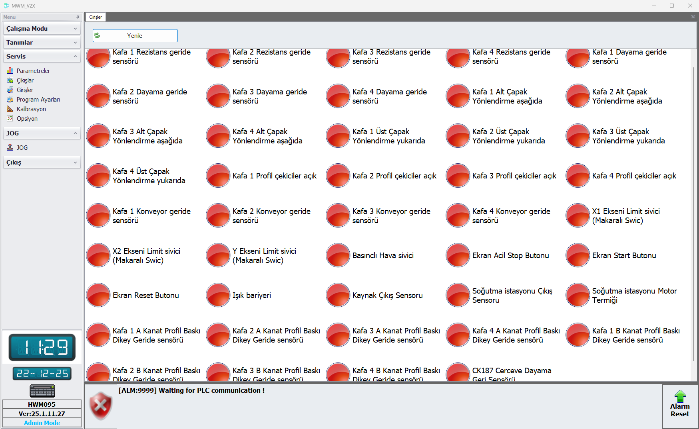

**Inputs :** Sensör ve switch bilgileri bu sayfadan kontrol edilir. 

## Manual Control Page
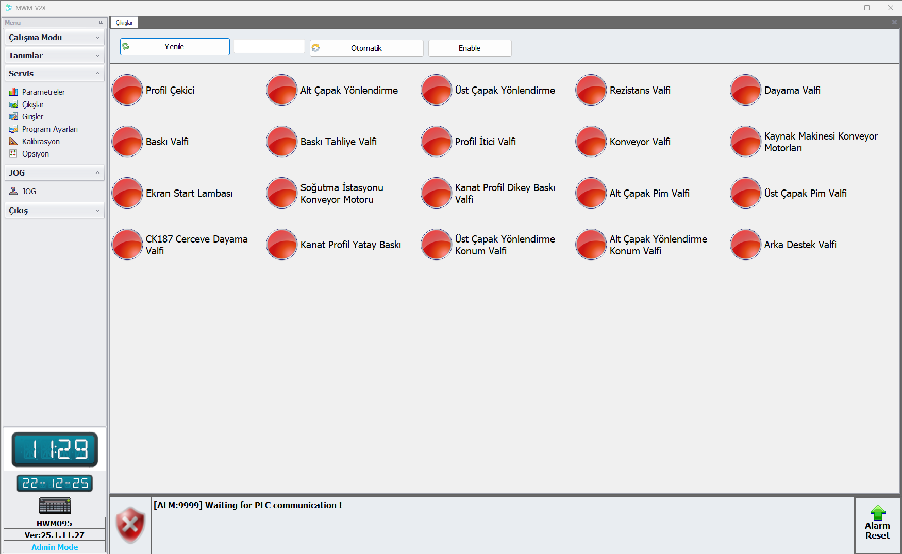

**Outputs :** Bu sayfada valfler 'Enable' butonuna basıldıktan sonra manual olarak çalıştırılır. Valflerin otomatik çalıştırılabilmesi için 'Otomatik' butonu aktif edilir.  

## Parameters Page
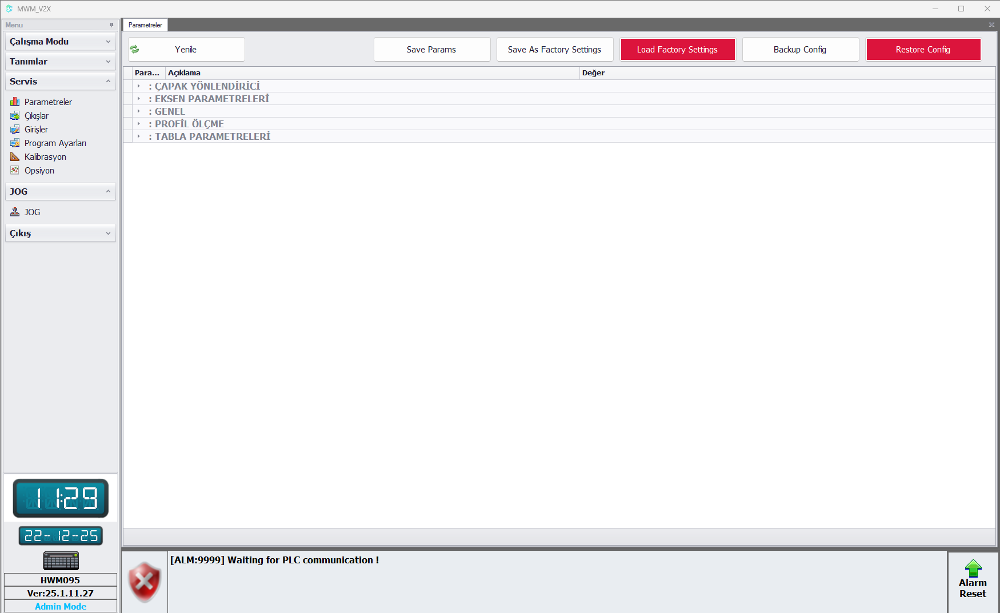

- Makineye ait tüm parametreler ve parametre işlemleri için gerekli butonlar bu sayfadadır.
- Parametreler bölümlere ayrılmıştır.

### Parameters Page Buttons

- **Save Params**: Parametre sayfasında yapılan değişiklikleri kaydeder.
- **Refresh**: Değişiklik yapıldığında sayfayı yenilemek için kullanılır.
- **Save As Factory Settings**: Mevcut olan parametreler fabrika ayarları olarak kaydedilir.
- **Load Factory Settings**: Fabrika ayarları geri yüklenir.
- **Backup Config**: Makinenin mevcut eksen konfigürasyon parametreleri .xml uzantısı ile dışarı aktarılır.
- **Import Params**: Makinede kullanılmak üzere eksen konfigürasyon parametreleri içeri aktarılır.

### Parameters Sections

#### Burr Guide
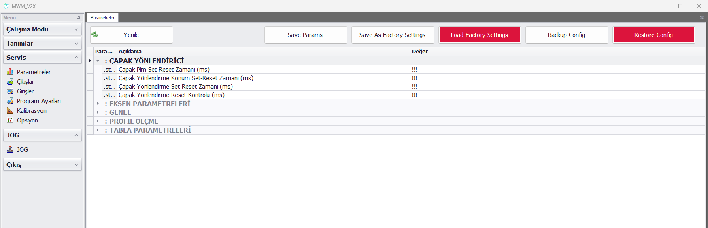

**Burr Guide :** Çapak yönlendirici pistonlarına ait parametreler bu bölümdedir. 

#### Axis Parameters
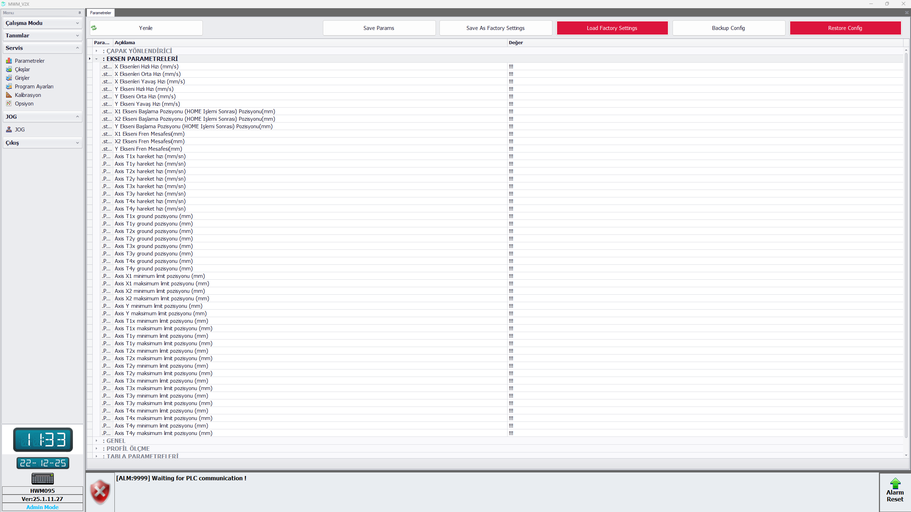

**Axis Parameters :** Eksenlere ait hızlar, fren mesafeleri, min-max limit pozisyonları bu bölümdedir.

#### General
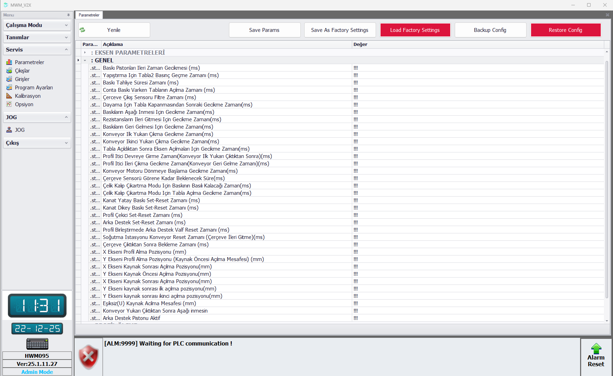

**General :** Makineye ait genel parametreler bu bölümdedir.

#### Profile Measurement
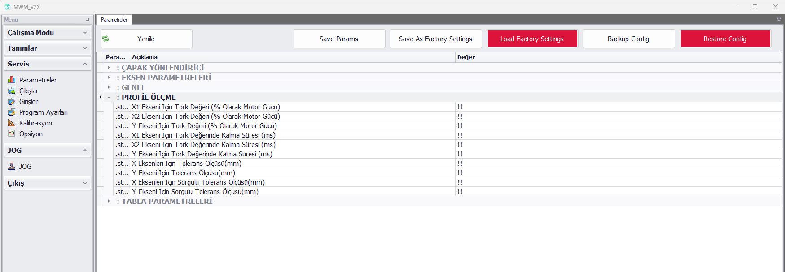

**Profile Measurement :** Eksenlere ait ölçüm için gerekli tork ve tolerans değerleri bu bölümdedir.

#### Table Parameters
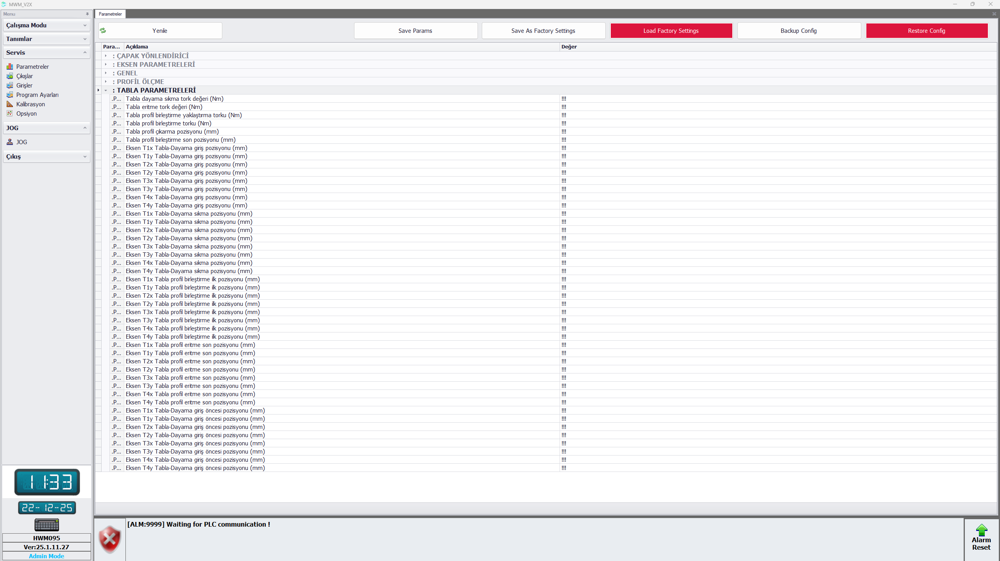

**Table Parameters :** Senaryoda tüm tabla eksenlerinin gideceği pozisyon parametreleri, uygulayacağı özel tork değerleri bu sayfadadır.
